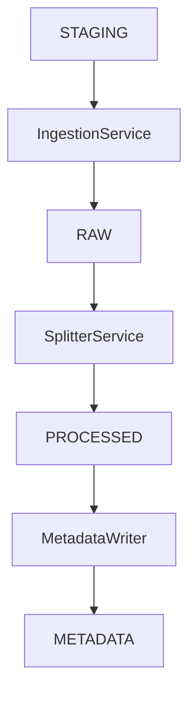
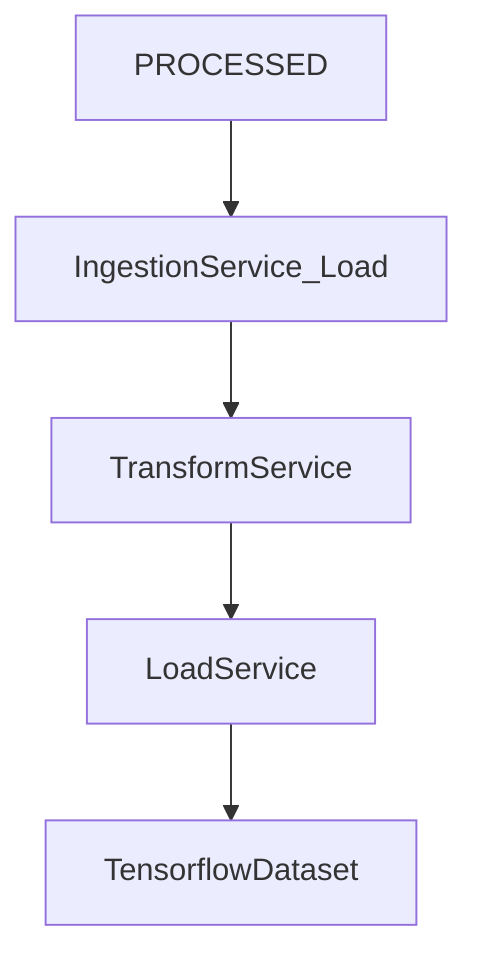

# 🧱 Convolution CV — Project Architecture

Convolution CV is a CNN-based pattern classification system using indicator charts as image input. This document outlines the core architecture of the ETL and runtime pipelines, component responsibilities, and design principles such as immutability and modular reuse.

---

## 📦 Directory Structure (High-Level)

```text
artifacts/
├── data/
│   ├── raw/                    # Extracted from staging, immutable
│   ├── processed/              # Train/Val/Test image folders
│   └── metadata/               # Metadata CSVs (e.g., pattern_metadata.csv)
├── models/                     # Trained model checkpoints
├── logs/                       # Training logs
````

---

## 🔷 ETL Pipeline (One-Time Execution)



### Components

| Component               | Role                                                                     |
| ----------------------- | ------------------------------------------------------------------------ |
| `IngestionService`      | Extracts and reorganizes staged PNGs into `raw/instrument/pattern_type/` |
| `SplitterService`       | Stratified 70/15/15 split into `processed/{train,val,test}/...`          |
| `MetadataWriterService` | Writes metadata to `pattern_metadata.csv`                                |

### Output

```text
artifacts/data/
├── raw/
│   └── AUD_CHF/Trend_Reversal_Bullish/AUD_CHF_0001.png
├── processed/train|val|test/
│   └── NZD_JPY/LC_Convergence_Bearish/NZD_JPY_0091.png
└── metadata/pattern_metadata.csv
```

---

## 🟧 Training & Inference Pipeline (Reusable Runtime Logic)



### Components

| Component          | Role                                                        |
| ------------------ | ----------------------------------------------------------- |
| `IngestionService` | Loads image paths + labels from processed split directories |
| `TransformService` | Applies resizing, normalization, and augmentation           |
| `LoadService`      | Builds `tf.data.Dataset` from transformed data              |

---

## 🔁 Double Use of `IngestionService`

| Context       | Method                   | Purpose                             |
| ------------- | ------------------------ | ----------------------------------- |
| **ETL Phase** | `extract_from_staging()` | Ingest raw image data from staging  |
| **Runtime**   | `load_split("train")`    | Load image-label pairs for training |

---

## ✅ Design Principles

* **Immutable Data:** Once extracted, data in `raw/` is never modified.
* **Modular Services:** Each component has a focused responsibility and is reused across pipelines.
* **Auditability:** All metadata is versioned and centrally stored.
* **Separation of Concerns:** ETL is decoupled from runtime pipelines (training/inference).
* **Extensibility:** Easy to integrate MLflow, Grad-CAM, or additional services without disruption.

---

## 🛠️ Future Enhancements

- **MLflow integration for training & inference pipelines**  
  _(⚠️ Not used in ETL)_:  
  MLflow may be added to track experiments, log model metrics, store artifacts like confusion matrices, and manage model versions. It will be integrated into the **training and inference pipelines only**, not the ETL process, which remains static and reproducible by design.

- **Optional TFRecord export in LoadService**
- **Augmentation visualization tools**
- **Confusion matrix & feature attribution dashboards**

