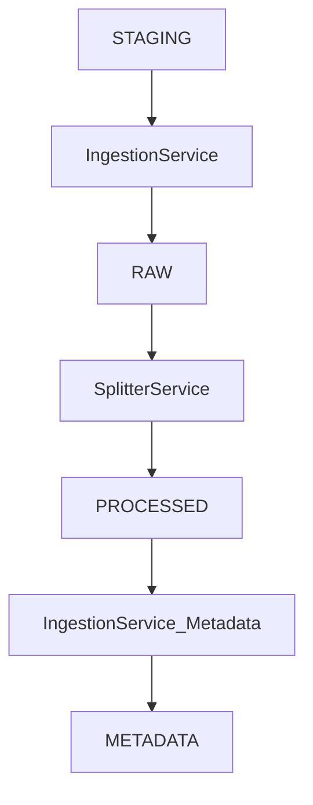
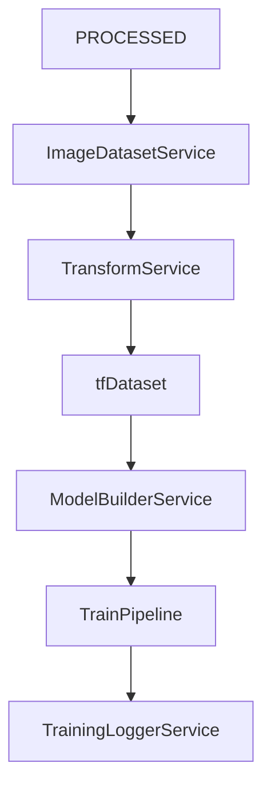

# 🧱 Convolution CV — Project Architecture

Convolution CV is a CNN-based pattern classification system using indicator charts as image input. This document outlines the architecture of the ETL and runtime pipelines, component responsibilities, and guiding design principles.

---

## 📦 Directory Structure (High-Level)

```text
artifacts/
├── data/
│   ├── raw/                    # Immutable image snapshots from staging
│   ├── processed/              # Stratified Train/Val/Test image folders
│   └── metadata/               # Metadata CSVs (e.g., pattern_metadata.csv)
├── models/                     # Trained model checkpoints (.h5, .keras)
├── logs/                       # Training logs (JSON, CSV, TensorBoard)
```

---

## 🔷 ETL Pipeline (One-Time Execution)



### 🔹 Components

| Component          | Responsibility                                                                                      |
| ------------------ | --------------------------------------------------------------------------------------------------- |
| `IngestionService` | Extracts & renames staged PNGs into `raw/instrument/pattern_type/`, and writes metadata after split |
| `SplitterService`  | Applies stratified 70/15/15 split into `processed/{train,val,test}/...`                             |

### 📤 Output Example

```text
artifacts/data/
├── raw/
│   └── AUD_CHF/Trend_Reversal_Bullish/AUD_CHF_0001.png
├── processed/
│   ├── train/
│   │   └── NZD_JPY/LC_Convergence_Bearish/NZD_JPY_0091.png
│   ├── val/
│   └── test/
└── metadata/
    └── pattern_metadata.csv
```

---

## 🟧 Training Pipeline (Runtime Logic)



### 🔸 Components

| Component               | Role                                                               |
| ----------------------- | ------------------------------------------------------------------ |
| `ImageDatasetService`   | Loads image paths + labels from `processed/` split folders         |
| `TransformService`      | Loads transform config and applies mode-specific augmentations     |
| `ModelBuilderService`   | Builds CNN model based on config and number of classes             |
| `TrainPipeline`         | Coordinates training, validation, evaluation, and logging          |
| `TrainingLoggerService` | Saves training history, evaluation metrics, plots, and model files |

---

## 🔁 `IngestionService` is ETL-Only

| Phase   | Method                   | Purpose                                |
| ------- | ------------------------ | -------------------------------------- |
| **ETL** | `extract_from_staging()` | Extract staged data → `raw/`           |
|         | `write_metadata()`       | Save `pattern_metadata.csv` post-split |

**Runtime loading is now fully handled by `ImageDatasetService`.**

---

## 🔄 Inference Pipeline (Planned)

The inference pipeline will reuse many components from training but operate in **read-only, prediction-only** mode.

| Phase     | Training                       | Inference                                    |
| --------- | ------------------------------ | -------------------------------------------- |
| Transform | Augmentations (`mode="train"`) | Resize & normalize only (`mode="inference"`) |
| Target    | Supervised labels              | Predicted class or softmax probabilities     |
| Output    | Metrics, plots, checkpoints    | Predictions (CSV, visual overlay, etc.)      |

### 🔸 Expected Components

| Component                    | Role                                              |
| ---------------------------- | ------------------------------------------------- |
| `InferencePipeline`          | Orchestrates prediction flow                      |
| `ImageDatasetService`        | Loads data to infer on (from split or custom dir) |
| `TransformService`           | Applies resize/normalization                      |
| `ModelLoader` (planned)      | Loads `.keras` or `.h5` model checkpoint          |
| `PredictionWriter` (planned) | Writes predictions, overlays, or CSV outputs      |

---

## ✅ Design Principles

* **Immutable `raw/`:** Raw data is frozen post-extraction for reproducibility
* **Modular Services:** Shared services like `TransformService` and `ImageDatasetService` are reused across pipelines
* **Decoupled Pipelines:** ETL and runtime flows are isolated for clarity and testability
* **Audit-Friendly Metadata:** Centralized CSVs for lineage and evaluation
* **Extensibility:** Easy to extend with tools like Grad-CAM, MLflow, or TFRecord export

---

## 🔮 Future Enhancements

| Feature                           | Status         | Notes                                                  |
| --------------------------------- | -------------- | ------------------------------------------------------ |
| MLflow integration                | ⏳ Planned      | For experiment tracking, model registry (runtime only) |
| TFRecord export support           | ⏳ Planned      | For high-throughput data ingestion                     |
| Augmentation preview in Dash      | ⏳ Planned      | Visual debug of transform configs                      |
| Confusion matrix + attribution UI | ⏳ Planned      | Dash-based diagnostics after evaluation                |
| Inference pipeline                | 🚧 Not started | Needed for production predictions and CLI batch runs   |

